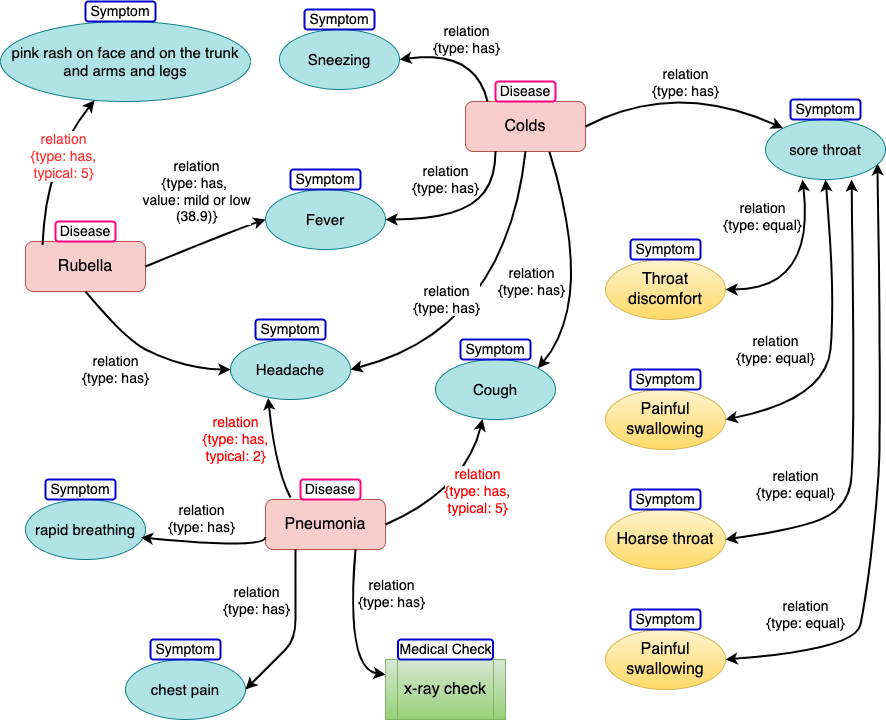

# disease check flow
The below description is my thought on how to do disease checking by symptoms

I did a demo site: http://earlyhealth.life:9000 which I get the user question's embedding and do a vector db(chroma) search to get the disease items in chroma, then use openAI to compose the answer. 

Obviously it is just a demo site, based on the doctor's diagnosis process, my rough idea is to extract relevant symptoms from the patient's questions, then match them with the backend knowledge graph. If the patient provides too little information to decide the disease, the bot then will prompt the patient to provide more information. So first we need to have a knowledge graph about diseases and symptoms, The knowledge graph DB provides a query function, but the symptom terms provided by the patient usually are different with the symptoms entity in the knowledge graph db, although their meanings are the same, so the query function of the knowledge graph cannot be directly used. Since vectors can provide similarity matching, it seems that using vector matching is a feasible solution. Based on this, the process of disease diagnosis in my mind is the follows:

1. Build a disease knowledge graph from existing documents, including various disease information, disease symptom information, medical examination information, and the relationship between them. Do we need get the embedding for each disease symptom for the mapping search?
   
2. The patient asks questions, such as: I have a fever and a headache, what disease may I have?

3. The doctor bot uses openAI API to analyze the patient's question, and extracts that the symptoms are fever and headache, and get the embedding for them.
 
4. The bot searches the symptoms in knowledge graph db and find 3 related diseases: Codes, Pneumonia, Rubella (I want to search feature by feature, like this: select diseases from db where symptoms='fever' and symptoms='headache' when using sql, can it be implemented in vector search?). The bot want to exclude some disease, so the bot asks some additional symptoms to the patient: do you cough?
   
5. The patient answers: I don't cough, just have a fever for 3 days, the temperature is about 38.5 oC, and have a headache

6. The bot based on the patient's new answer, search in the knowledge graph db based on the symptoms: Fever (mild), headache, no cough, the result is: Colds or Rubella, so the bot tries to get the accurate disease, so ask the patient: Do you have pink rash on face and on the trunk and arms and legs?

7. The patient check, and says there is some pink rash in the body, the bot finally give the conclusion: Rubella.

I want to use embedding matching, but should do each symptom's embedding search, just like we check each item in the checklist, if I use sql, the query like this: select diseases from db where symptoms='fever' and symptoms='headache', so how to do search on each symptom using embedding match? 

Is there any opensource framework which is able to do embedding query/compare on entities of knowledge graph db?

The supposed knowledge graph like below:

